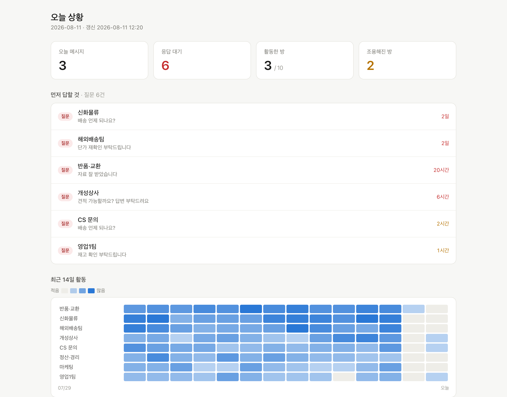
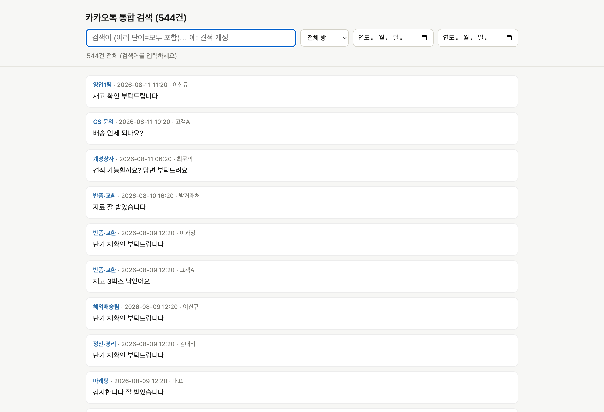
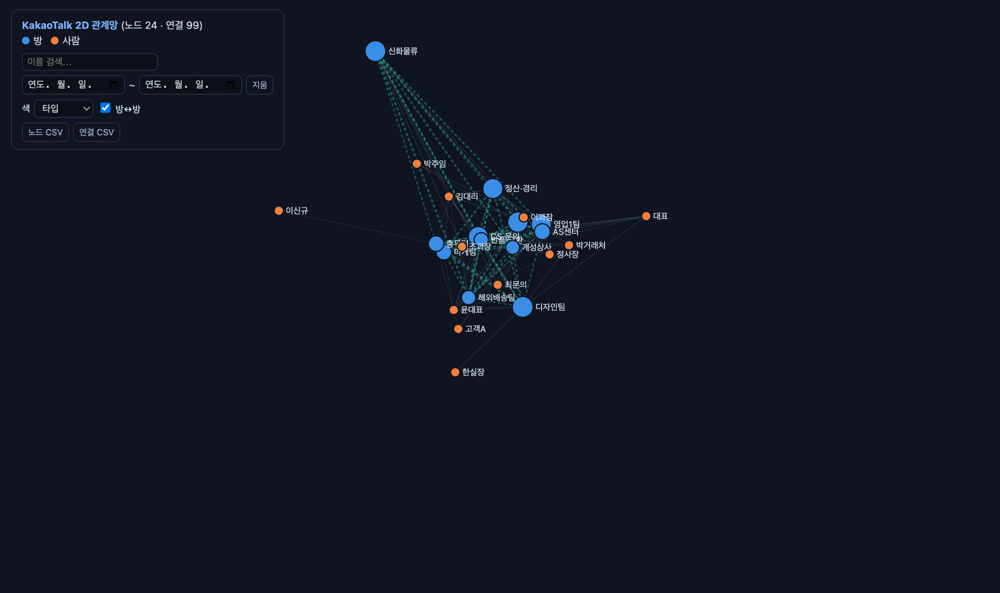

# kakao-auto — KakaoTalk Windows Auto Chat Collector & Archiver (카카오톡 자동 수집·백업)


**카카오톡 PC의 모든 대화방을 자동으로 순회해 수집하고, 방마다 CSV 한 장으로 정리하는 윈도우 전용 도구.**

Automatically cycles through **every KakaoTalk chat room on Windows**, exports the full history via the app's own `Ctrl+S`, stores it in **SQLite**, and writes **one CSV per room** for analysis. Runs unattended every night. Read-only, fully offline.

<sub>KakaoTalk scraper · KakaoTalk exporter · chat archiver · KakaoTalk backup · Windows chat automation · read-only messenger backup · 카카오톡 자동 수집 · 카카오톡 대화 백업 · 카카오톡 스크래퍼 · 카카오톡 대화 내보내기 · 카톡 백업</sub>



---

# ⚠️ USE AT YOUR OWN RISK — 반드시 먼저 읽으세요

> ### 이 도구를 실행하는 순간, 아래 모든 책임과 위험을 **전적으로 본인이** 진다는 데 동의하는 것입니다.
> ### 동의하지 않으면 **사용하지 마세요.** (전문: [LICENSE](LICENSE) · [NOTICE](NOTICE))

**이 프로젝트는 카카오(Kakao)와 아무 관련이 없는 비공식 개인 아카이빙 도구입니다.**

| | |
|---|---|
| 🚫 **약관 위반** | 카톡 클라이언트 자동화·스크래핑은 **카카오 이용약관 위반**입니다. **계정이 정지·삭제될 수 있습니다.** 그 위험은 온전히 본인 몫입니다. |
| ⚖️ **개인정보 책임=본인** | 수집물엔 **타인(고객·거래처)의 개인정보**가 담깁니다. **개인정보보호법(PIPA) 등 준수 책임은 100% 사용자**에게 있습니다. |
| 🙅 **금지 용도** | 타인 감시·무단 접근·본인이 당사자가 아닌 대화 감청·기타 불법 목적 **금지.** |
| 📵 **무보증·무책임** | **AS-IS.** 카톡 업데이트로 언제든 깨질 수 있고, 저자는 어떤 손해·계정조치·법적 책임도 지지 않습니다. |

> **ENGLISH — USE AT YOUR OWN RISK.** Independent, unofficial personal archiving tool, **NOT affiliated with Kakao**. Automating the KakaoTalk client **violates Kakao's Terms of Service** and may get your account suspended. It does not break encryption or bypass authentication — it drives the app's own export, on your own PC, in conversations you are a party to. The archive contains **other people's personal information**; **YOU are the data controller**. Own account only. Read-only. No warranty, no liability.

---

## 설치 (윈도우) · Install

**파이썬도, 빌드도 필요 없습니다.**

1. [**Releases**](https://github.com/AidanKR/kakao-auto/releases/latest) 에서 **`KakaoAuto-Setup.exe`** 다운로드
2. 실행 → "Windows가 PC를 보호했습니다" 창이 뜨면 **추가 정보 → 실행** (서명 인증서가 없는 오픈소스라 정상)
3. 시작 메뉴 → **KakaoAuto** 실행

설치 위치는 `%LOCALAPPDATA%\KakaoAuto` 이고, `config.json`·`kakao.db`·결과물이 모두 그 옆에 저장됩니다.

> The installer is built automatically on a Windows CI runner (`.github/workflows/build-windows.yml`).

## 쓰는 법 — Enter 한 번

**전제: 카카오톡을 켜고 '채팅' 탭으로 두세요.** 그 상태가 아니면 수집이 안 됩니다.

KakaoAuto를 실행하고 **Enter만 누르면** 아래가 한 번에 이어집니다.

```
수집 → 정리(선택) → 방별 CSV → 사진 백업
```

숫자 메뉴는 개별 기능이 필요할 때만 쓰면 됩니다.

## 매일 자동 (무인)

메뉴 **`11`** 을 **한 번** 누르면 매일 **새벽 02:00** 에 위 '전체 실행'이 자동으로 돕니다. 관리자 권한이 필요 없고, 절전도 함께 꺼줍니다. 해제는 **`12`**.

- 시각 변경: `config.json` 의 `"nightly_time": "02:00"` 수정 후 메뉴 `11` 재실행
- 전제: 그 시각에 **PC가 켜져 있고 로그인·잠금해제 상태**, **카카오톡이 켜져 있고 채팅 탭**
- **모니터가 없어도 됩니다.** 방 순회가 키보드 방식이라 화면이 꺼진 헤드리스 상태에서도 동작합니다(실기 검증). 노트북이면 덮개를 닫아도 됩니다 — 단 덮개 동작을 "아무 것도 안 함"으로 두세요.
- 카카오톡은 **끄지 않고 켜둔 채로** 둡니다. 굳이 끄고 싶으면 `close_kakao_after: true`.

## 나오는 것

`share_dir`(기본 `C:/kakao_share`) 아래에 이렇게 쌓입니다.

```
C:\kakao_share\
  csv\
    [발주] 신화 X KMALL\
      발주 신화 X KMALL.csv      ← 방마다 폴더 하나 + CSV 하나
    CS 문의\
      CS 문의.csv
    _rooms_index.csv             ← 방 목록·건수·처음/마지막 시각
  media\                        ← 실제 사진만 (이모티콘·스티커 제외)
  kakao.db                       ← 원본 DB 사본
```

- **CSV 컬럼**: `room, date, time, datetime, sender, message`
- **인코딩** `utf-8-sig` — 엑셀에서 한글 안 깨지고, `pandas.read_csv` 로 바로 읽힙니다
- 매 실행 **전량 갱신**이라 항상 최신 전체가 방별로 정리됩니다
- 사람이 읽는 **날짜별 TXT**도 원하면 `nightly_txt: true` → `share_dir/txt/<날짜>/<방>.txt`

## 그 밖의 기능 (메뉴)

| 메뉴 | 기능 |
|---|---|
| `3` | **대시보드** — 누구에게 답을 안 했는지, 14일 활동 히트맵, 조용해진 거래처 |
| `4` | **통합 검색** — 전 대화를 한 번에 검색 (오프라인 단일 HTML) |
| `5` | **관계망** — 방↔사람 2D 그래프 |
| `6` | **엑셀** — 방목록·응답대기·메시지 3시트 |
| `7` | **금액·약속·계좌 추출** — 정규식, AI 불필요 |
| `8` | **사진 백업** — 카톡이 만료시키기 전에 보존 (이모티콘 제외) |
| `9` | **DB 백업** — 회전 백업 + 선택적 AES 암호화 |
| `10` | **일일 브리핑 / 응답대기** — 규칙 기반, 키 있으면 AI 요약(로컬 Ollama 가능) |
| `14` | **채팅 탭 위치 보정** — 카톡이 프로필 탭에서 시작할 때 대비 |





## 잘 안 될 때

| 증상 | 원인·해결 |
|---|---|
| 프로필/친구 목록만 읽힘 | 카톡이 **친구 탭**에서 시작한 것. 메뉴 `14` 로 채팅 아이콘 위치를 한 번 보정하세요 |
| `채팅목록을 못 찾음` | 카톡이 꺼져 있거나 로그인 전. 켜고 **채팅 탭**으로 |
| CSV 폴더가 비어 있음 | 수집만 하면 DB에만 쌓입니다. **Enter(전체 실행)** 를 돌리면 CSV가 생깁니다 |
| 순회가 엉킴 | 배치가 도는 몇 분간은 이 PC의 마우스·키보드를 쓰지 마세요 (GUI를 조작 중입니다) |
| 이모티콘만 백업됨 | `skip_emoticons: true`(기본) 확인. `media_min_bytes` 로 작은 이미지 제외 |

## 설정 (config.json)

새 버전에서 항목이 추가되면 **실행할 때 자동으로 채워집니다**(기존 값은 보존, 원본은 `config.json.bak`). 손으로 고칠 일이 거의 없습니다.

자주 건드리는 것만:

```jsonc
{
  "share_dir": "C:/kakao_share",   // 결과 저장 폴더 (구글드라이브 경로도 가능)
  "nightly_time": "02:00",         // 무인 실행 시각
  "nightly_txt": false,            // 날짜별 TXT도 만들지
  "nightly_media": true,           // 사진 백업 포함
  "close_kakao_after": false,      // 끝나고 카톡 끄기
  "backup_passphrase": ""          // 채우면 백업을 AES 암호화
}
```

## 소스에서 쓰기 (개발자용)

설치파일 대신 소스로 돌리려면 윈도우에서 `1_install.bat`(의존성) → `config.example.json` 을 `config.json` 으로 복사 → `python kakao.py`. 직접 exe를 만들려면 `build_exe.bat`.

## 요구사항

- **Windows** (카카오톡 PC 클라이언트를 조작하므로 윈도우 전용)
- 카카오톡 로그인 + **채팅 탭**
- 수집 전용 PC 권장 — 순회 중에는 사람이 그 PC를 쓰기 어렵습니다

## 어떻게 읽어내나 (기술 메모)

이 버전 카카오톡은 대화 목록과 메시지를 **직접 그려서**(owner-drawn) UI Automation으로는 글자가 전혀 잡히지 않습니다. 그래서 텍스트를 긁는 대신 **앱 자체의 `Ctrl+S` 대화 내보내기**를 자동화하고, 저장 대화상자는 UIA가 멈추는 구간이라 win32로 따로 처리합니다. 친구 목록과 채팅 목록은 컨트롤 클래스가 같아서 **컨트롤 이름(`ChatRoomListCtrl`)** 으로 구분합니다.

## License

**Apache License 2.0** — see [LICENSE](LICENSE) and [NOTICE](NOTICE).

Commercial use, modification, and redistribution are permitted free of charge. In return, Apache 2.0 requires that you:

- keep the copyright, patent, trademark, and attribution notices,
- **reproduce the contents of the [NOTICE](NOTICE) file** in any redistribution or derivative work (Section 4(d)), which is how the original author is credited,
- state that you changed any files you modified, and
- include a copy of the License.

It also grants an explicit patent license to users, and terminates that patent grant for anyone who starts patent litigation over the work.

> Created and maintained by **AidanKR (Lee Donghyuk)** — https://github.com/AidanKR/kakao-auto

## Disclaimer & Acceptable Use

**kakao-auto is an independent, unofficial personal archiving tool. It is NOT affiliated with, endorsed by, sponsored by, or connected to Kakao Corp. or KakaoTalk.**

"Kakao" and "KakaoTalk" are trademarks of Kakao Corp. Neither this software nor its license grants any right, title, license, or interest in any intellectual property, trademark, service, product, or data of Kakao Corp. or any other third party.

### Terms of Service — read this before you install

Automating, scraping, or otherwise driving the KakaoTalk desktop client **violates KakaoTalk's Terms of Service.** Using this software may result in **restriction, suspension, or permanent termination of your KakaoTalk account**, and Kakao may take other measures at its discretion. **That risk is entirely yours.** If you are not willing to accept it, do not use this software.

Kakao may change its client or its terms at any time, which can break this tool or increase the risk of using it, without notice.

### Privacy and personal data — you are the data controller

Conversation archives created with this software contain **other people's personal information**: names, phone numbers, addresses, order details, photographs, and more.

**You — not the author — are the data controller.** You are solely responsible for determining whether and how your use complies with applicable privacy and data-protection law, including the **Personal Information Protection Act (PIPA)** of the Republic of Korea and any equivalent law in your jurisdiction. That includes having a lawful basis, limiting purpose and retention, applying security safeguards (the tool ships optional AES backup encryption for this reason), and honoring access and deletion requests from data subjects.

Use only on an account you own, only for conversations you are a party to, and only for lawful purposes. **Do not** use this software for surveillance of others, unauthorized access, interception of communications you are not a party to, employee monitoring without a lawful basis, or any other unlawful purpose.

If you deploy this inside a company, treat the archive as a regulated personal-data store: restrict access, document the purpose, and set a retention period.

### No warranty, no liability

This software is provided under the Apache License 2.0 on an **"AS IS" BASIS, WITHOUT WARRANTIES OR CONDITIONS OF ANY KIND**, either express or implied. See Sections 7 and 8 of the [LICENSE](LICENSE).

To the maximum extent permitted by law, the author shall not be liable for any damages, data loss, account restriction or termination, regulatory penalty, or legal claim arising from your use or misuse of this software.

**This document is not legal advice.** If you intend to use this in a business context, get your own legal review first.

### Not affiliated, not an exploit

This tool does not break encryption, bypass authentication, or access anything you cannot already see yourself. It drives the KakaoTalk client's own **export** feature on your own machine, in conversations you are already a member of. It is **read-only** — it never sends a message. That does not make it compliant with Kakao's terms; see above.
